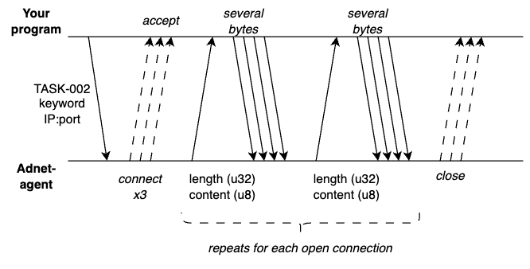

# Task 2: TCP server

In this assignment you will implement TCP server the gets incoming connection
requests and should send a number of bytes as requested by the client.

The course git repository contains [Rust
templates](https://github.com/PasiSa/AdvancedNetworking/tree/main/assignments/task-002)
for this task that you may use if you want.

Follow these steps in your program:

1. Open a listening TCP socket that binds to a port of your choice. You should
   choose a port number between 1024 and 49151

2. Send a control message to the _adnet-agent_ server that follows this form:
   `TASK-002 keyword IP:port`. As in previous task, _keyword_ is a random word
   you receive in MyCourses assignment. _IP_ is the IP
   address your program runs at listening to incoming connections, and _port_ is
   the port that you chose to bind for listening. If you
   are running your program in node "lh1" of our `simple_topo` Mininet
   configuration, the IP address is 10.0.0.1.

3. _adnet-agent_ starts opening connections to your server. There will be
   altogether **three concurrent connections**. A client first sends 5
   bytes of data. First four bytes is a **32-bit unsigned integer** in network
   (big-endian) byte order. This tells how many bytes the agent excepts to
   receive from this socket. You should send this many bytes, all containing the
   value that is indicated by the fifth byte in request from _adnet-agent_. Note
   that your implementation should be prepared to handle multiple connections in
   parallel.

4. When you have finished sending the requested number of bytes, you should
   output the following to terminal: "`Wrote N bytes of byte B`". A new
   request may arrive from a client, with similar 5-byte format, to which
   you should respond in the same way as described above. If a client does
   not need more data from this socket, it closes the TCP connection. Your
   program should therefore be able to handle closing TCP connection without
   problems. Not that while one connection closes, there may be other
   connections still open, performing transmission.

5. When _adnet-agent_ has closed all connections it opened in the beginning,
   this assignment is complete and successful.

The below diagram illustrates the expected communication between your
implementation and _adnet-agent_.

Execute your program and the _adnet-agent_ in Mininet `simple_topo` topology. As
in previous assignment, _adnet-agent_ should run in host "_rh1_", and your
implementation should run in host "_lh1_". Run your implementation in Mininet
configuration with following properties: `sudo aalto/simple_topo.py --delay=50ms
--bw=0.5`. You can also try other scenarios if you are interested.

You should submit to MyCourses the output of your program, consisting multiple
lines of the above mentioned "`Wrote N bytes of byte B`" messages.

## Tips

- In Rust you can convert unsigned 32-bit integer (u32 type) into big-endian
  4-byte array using function `to_be_bytes`
  ([example](https://doc.rust-lang.org/std/primitive.u32.html#method.to_be_bytes)),
  and vice versa using `from_be_bytes`
  ([example](https://doc.rust-lang.org/std/primitive.u32.html#method.from_be_bytes))

- See the different server **[examples](https://pasisa.github.io/AdvancedNetworking/examples/)** for different
  design alternatives (non-blocking events, thread-based, collaborative
  multitasking). Which one would be most suitable in this case?
